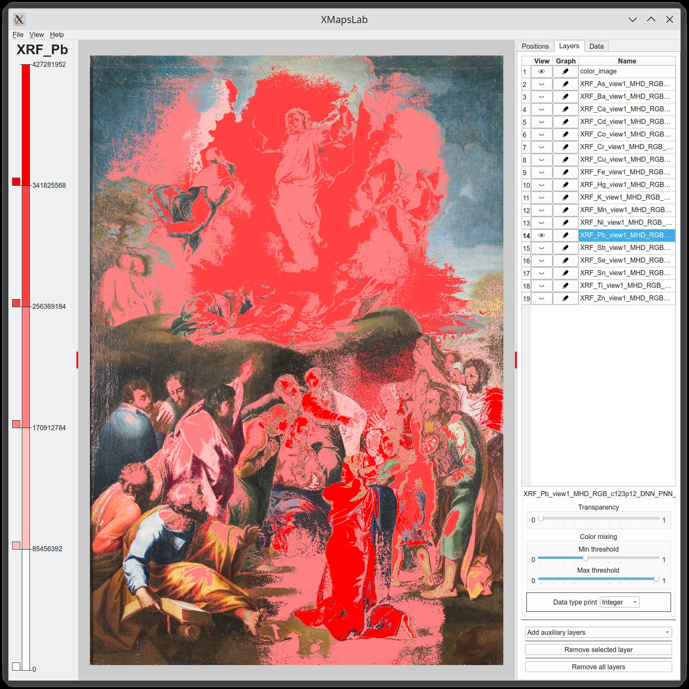

# XMapsLab

Program to create and study maps for Cultural Heritage chemical applications



## General
This repository contains the source code for the XMapsLab program that we developed as part of our publication:

TO BE INCLUDED

## Project website and pre-compiled binaries
https://calipso.ugr.es/xmapslap.org

This website also provides pre-compiled binary releases for Windows.

## Note
Please note the software is provided "as is".  Use it at your own risk, although data loss is unlikely. Do take the standard precautions like saving your work in other programs.

## License
Most code is [GNU General Public License v3](https://www.gnu.org/licenses/gpl-3.0.en.html)
(see [license.txt](license.txt)), except the code for doing the MHD computation that has an [Apache 2 License](https://www.apache.org/licenses/LICENSE-2.0)

## Requirements
This project compiles under Linux and Windows. In both cases the project requires these additional components:

* ```Qt SDK``` (libraries + QtCreator + MingGW compiler), checked with version 6.2.4: https://www.qt.io/
* ```OpenCV```, checked with version 4.9: https://opencv.org/
* ```CMake```, checked with version 3.27.9: https://cmake.org/
* ```GLEW```, checked with version 2.1: https://glew.sourceforge.net/
* ```Eigen```, checked with version 3.4: https://eigen.tuxfamily.org/index.php?title=Main_Page

Below we explain how these requirements are installed, both for Windows and Linux.

## Build process for Linux (tested with [Kubuntu](https://kubuntu.org/) 22.04.3 & [Linux Mint](https://linuxmint.com/) 21.3)

### Installation of the requirements under Linux
* update your environment: `sudo apt update ; sudo apt upgrade`
* install the compiler and other complementary tools: `sudo apt install build-essential libxcb-cursor0 cmake cmake-qt-gui wget git`
* create a folder to place all the necessary code and libraries and change to that folder: `cd ~ ; mkdir code ; cd code`
* now we get and compile [OpenCV](https://opencv.org/)
  * download the sources: `wget https://github.com/opencv/opencv/archive/4.9.0.zip`
  * unzip the downloaded archive: `unzip 4.9.0.zip`
  * change the name of the created folder: `mv opencv-4.9.0 opencv-4.9`
  * create a new folder to hold the created library: `mkdir opencv-4.9.0`
  * change to the sources directory: `cd opencv-4.9`
  * create a new folder to hold the object code: `mkdir build`
  * start the CMake GUI: `cmake-gui`
  * click the "Browse Source..." button and select the "sources" folder of OpenCV, by default this should be `/home/user/code/opencv-4.9` with `user` being your Linux user name
  * click the "Browse Build..." button and select the "build" folder you previously created for OpenCV, by default this should be `/home/user/code/opencv-4.9/build`
  * click the "Configure" button and select "Unix Makefiles" from the drop-down list, leave "Use native compilers" selected, then click the "Finish" button
  * this runs some processes and then shows some options; from these options select BUILD_JPEG and BUILD_PNG, in addition to the already selected ones
  * specify where the library and complementary files will be placed for a local installation: in the field CMAKE_INSTALL_PREFIX change `/usr/local` to `/home/user/code/opencv-4.9.0`
  * click the "Generate" button to generate the Makefiles, then close the CMake GUI window
  * back in the command line, change to build folder: `cd build`
  * compile OpenCV by running `make` (depending on your machine and its processors it could be done quicker with the `-j` option and specifying the number of threads to use; e.g., `make -j4`); this process may take quite a while ...
  * finally do the local installation: `make install`
  * this should have added the compiled OpenCV to `~/code/opencv-4.9.0`
* now we get and and compile [GLEW](https://glew.sourceforge.net/)
  * change back to the code directory: `cd ~/code`
  * download the sources: `wget https://sourceforge.net/projects/glew/files/glew/2.1.0/glew-2.1.0.zip/download -O glew.zip`
  * unzip the downloaded archive: `unzip glew.zip`
  * rename the generated archive to avoid errors with the installation later: `mv glew-2.1.0 glew-2.1`
  * create a folder for the resulting installation: `mkdir glew-2.1.0`
  * if you follow this process on a real machine then the needed OpenGL drivers and development files for X11 should be installed already; nothing do to at this point
  * if, in contrast, you follow this process in a virtual machine then we have to install the needed OpenGL drivers and development files for X11 (using free drivers)
    * run `sudo apt install freeglut3-dev libx11-dev`
  * change to the GLEW sources folder: `cd glew-2.1`
  * edit the Makefile to specify Makefile a local installation instead of a global one: `nano Makefile`, look for `GLEW_DEST`, change `/usr` to `/home/user/code/glew-2.1.0`, save the file with Ctrl-O, and then exit nano with Ctrl-X
  * compile GLEW: `make`
  * install GLEW: `make install`
* now we get [EIGEN](https://eigen.tuxfamily.org/index.php?title=Main_Page)
  * change back to the code directory: `cd ~/code`
  * download the sources: `wget https://gitlab.com/libeigen/eigen/-/archive/3.4.0/eigen-3.4.0.zip`
  * unzip the downloaded archive: `unzip eigen-3.4.0.zip`
  * create a soft link: `ln -s eigen-3.4.0 Eigen`
* now we get [Qt](https://www.qt.io/)
  * open a browser and go to [`https://www.qt.io/download-open-source?hsLang=en`](https://www.qt.io/download-open-source?hsLang=en)
  * scroll down to find the "Download the Qt Online Installer" button and click it
  * select Linux and click on the "Qt Online Installer for Linux (64-bit)" button to download the install script
  * change to folder where you saved the downloaded script, make the script executable, and run it; e.g., `cd ~/Downloads ; chmod 755 qt-unified-linux-x64-4.6.1-online.run ; ./qt-unified-linux-x64-4.6.1-online.run`
  * this opens a dialog to configure the Qt installation
  * you need a Qt account to proceed on the first screen, so either use your existing account or generate a new account; then "Next >"
  * agree to the license on the next screen, either enter a company name or check the box that states that you are an individual, then "Next >"
  * simply "Next >" on the Welcome dialog
  * make a decision on the Contribution to Qt Development dialog, then "Next >"
  * in the Installation folder dialog, specify the target directory; e.g., `/home/user/code/Qt`
  * also leave the "Custom installation" box checked, then click "Next >"
  * in the Components tree, unselect "Qt Design Studio > Qt Design Studio X.Y.Z" and select "Qt > Qt 6.2.4"; in addition
  * if there are space issues, you can also unselect items that you do not need:
    * under the "Qt > Qt 6.2.4" subtree, you can de-select everything except "Desktop gcc 64-bit" and "Qt 5 Compatibility Module"
    * on the right side unselect "Preview"
  * add any additional components you may want, but leave the rest of the pre-selections as they are, then click "Next >"
  * in the License Agreement dialog, check the box that you agree to the license conditions, then click "Next >"
  * click "Next >" to start the installation of Qt (if you do not have enough disk space then "Next >" is greyed out)

### XMapsLab Compilation under Linux
* get the XMapsLab sources: `cd ~/code ; git clone https://github.com/dmperandres/XMapsLab.git`
* change to the main directory of the XMapsLab code: `cd ~/code/XMapsLab/code`
* edit the [```xmapslab.pro```](src/xmapslab.pro) project file; e.g., `kate xmapslab.pro`
  * at the top of the file, adjust the ```LINUX_PATH``` to the folder where the libraries are, in our case ```/home/user/code```
  * at the bottom of the file, adjust the ```INCLUDEPATH``` and ```LIBS``` paths to your respective user name and to your library versions of OpenCV and GLEW:
  ```
  INCLUDEPATH += /home/user/code/opencv-4.9.0/include/opencv4
  INCLUDEPATH += /home/user/code/opencv-4.9.0/include/opencv4/opencv2
  INCLUDEPATH += /home/user/code/glew-2.1.0/include
  INCLUDEPATH += $$PWD/shaders
  INCLUDEPATH += $${FILE_IO_PATH}
  INCLUDEPATH += $${COMMON_CLASSES_PATH}
  
  LIBS += \
      -L/home/user/code/glew-2.1.0/lib -lGLEW \
      -L/home/user/code/opencv-4.9.0/lib -lopencv_core -lopencv_highgui -lopenc>
      -L/usr/X11R6/lib64 -lGL
  }
  ```

  * once done with the edits in [```xmapslab.pro```](src/xmapslab.pro), save it and exit the editor
* run QtCreator: `cd ~/code ; Qt/Tools/QtCreator/bin/qtcreator`
* open XMapsLab project via "File > Open file or project..." and find the [```xmapslab.pro```](src/xmapslab.pro) in the folder ```~/code/XMapsLab/src```
* click on the "Configure project" button
* click on the "xmapslab [master]" project object in the list on the left, then in the vertical toolbar further to the left click on "Projects" (the one with wrench icon), and in the dialog that opens up unselect "Shadow build"
* if you want you can also edit/further adjust the [```xmapslab.pro```](src/xmapslab.pro) project file here, by clicking on the "Edit" icon on the vertical toolbar on the very left (the one with the document icon), then unfolding the tree under the "xmapslab [master]" project object, and double-clicking the [```xmapslab.pro```](src/xmapslab.pro) project file; make sure to save the project file done (Ctrl-S or File > Save xmapslab.pro)
* initiate the build via Ctrl-B or Build > Build Project "xmapslab"

### Running XMapsLab under Linux
Before you can run XMapsLab using the terminal or by double clicking on the program name, it is necessary to that the system knows where to find the libraries, otherwise you will get errors about that GLEW or OpenCV libraries are not found. There are several possibilities. Please, select the one you prefer depending on your conditions:

1. to define where are the libraries for the console using the LD_LIBRARY_PATH variable. The loader, ld, search for the libraries in some common places and also the folders that are defined in that variable. The way to do in the console is this:

      ```export LD_LIBRARY_PATH=$LD_LIBRARY_PATH:/home/dmartin/code/glew-2.1.0/lib64:/home/dmartin/code/opencv-4.9.0/lib```

      The command defines the variable maintaining the previous paths and adding the new ones we are interested in.

      Now it is possible to run the program in the console using its name. But it doesn't run by double clicking on the icon (more on this later)
      The problem is that the LD_LIBRARY_PATH variable will have the correct value for the current session. Next time you log in your account you have to repeat the command.

      The solution is to do this initialization automatically using the .bashrc file. You need to open the .bashrc file with a normal text editor, and for example, go to the last line and add the same command. Then save the file and the next time you log in your account the variable will be defined. You can check it by using the "env" command.

2. Another possibility is to make the paths to become global by instructing ld. That implies to modify the /etc/ld.so.conf or /etc/ld.so.conf.d and the run "ldconfig". In the case on our example with Linux Mint/Ubuntu, the process is very easy:
    1. you add a new file to /etc/ld.so.conf.d/, for example "glew_opencv.conf". You need to do that it as root:

        ```sudo nano /etc/ld.so.conf.d/glew_opencv.conf```
    2. add the paths:

        ```/home/USER/code/glew-2.1.0/lib64```

        ```/home/USR/code/opencv-4.9.0/lib```
    3. save the file
    4. update the paths with the new file:

        ```sudo ldconfig```.

    Now the paths are used gloablly. One side effect is that now you can run the application by double clicking on the icon.

3. The third possibility would be to use the "-rpath" in the compilation process to instruct the loader where to search for the libraries, but in that case the path is fixed.

Finally, the data must be correctly placed in relation to the program. This can be done in two ways:

* Copy the folders that are include in "data" folder in "code" folder

  ```cd ~/code/XMapsLab```

  ```cp -r data/pdb code/```

  ```cp -r data/projects code/```


* Link the folders:

  ```cd ~/code/XMapsLab```

  ```ln -s data/pdb code/pdb```

  ```ln -s data/projects code/projects```
